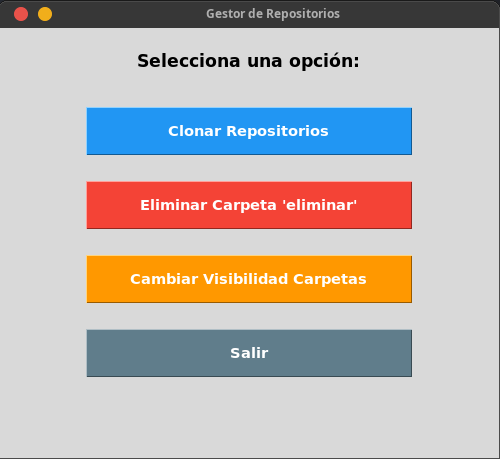

<h1 align="center">GitHub App</h1>

<p align="center">
  
</p>

<p align="center">
  Este proyecto permite gestionar tus repositorios de GitHub de manera sencilla usando una interfaz gráfica (Tkinter).
</p>

## Funcionalidades

- Clonar todos tus repositorios, tanto privados como públicos.
- Eliminar repositorios listados dentro de una carpeta llamada `eliminar`.
- Cambiar la visibilidad de los repositorios si los reorganizas en las carpetas correspondientes.

---

## Uso con Docker

### 0. Instalar Docker desde cero (Ubuntu/Debian)

Si todavía no tienes Docker, instálalo así (desde el repositorio oficial):

```bash
# 1. Actualizar e instalar dependencias
sudo apt update
sudo apt install -y ca-certificates curl

# 2. Añadir la clave GPG oficial de Docker
sudo install -m 0755 -d /etc/apt/keyrings
sudo curl -fsSL https://download.docker.com/linux/ubuntu/gpg -o /etc/apt/keyrings/docker.asc
sudo chmod a+r /etc/apt/keyrings/docker.asc

# 3. Añadir el repositorio de Docker
echo \
  "deb [arch=$(dpkg --print-architecture) signed-by=/etc/apt/keyrings/docker.asc] https://download.docker.com/linux/ubuntu \
  $(. /etc/os-release && echo "$VERSION_CODENAME") stable" | \
  sudo tee /etc/apt/sources.list.d/docker.list > /dev/null

# 4. Instalar Docker Engine
sudo apt update
sudo apt install -y docker-ce docker-ce-cli containerd.io docker-buildx-plugin docker-compose-plugin
```

> **Alternativa más simple** (si no quieres el repositorio oficial): `sudo apt install -y docker.io` instala Docker Engine desde los repos de Ubuntu. Con esto basta para este proyecto.

Comprueba que funciona:

```bash
sudo docker run hello-world
```

### 1. Requisitos previos

- Tener **Docker** instalado y el servicio en marcha:

```bash
sudo systemctl enable --now docker
```

- Agregar tu usuario al grupo `docker` y **cerrar sesión / reiniciar** para que el cambio surta efecto:

```bash
sudo usermod -aG docker $USER
sudo reboot   # o vuelve a iniciar sesión
```

> Sin esto, `docker` te devolverá un error de permisos tipo `permission denied` o `Cannot connect to the Docker daemon`.

### 1.1 Docker Engine junto con Docker Desktop instalado

En Linux, **Docker Desktop** y **Docker Engine** pueden estar instalados a la vez, pero **solo puede estar activo un daemon a la vez**. Los dos puntos de conflicto son:

- **El CLI de `docker`**: Docker Desktop lo instala en `/usr/local/bin/docker` y Docker Engine en `/usr/bin/docker`. Gana el que aparezca primero en tu `PATH` (compruébalo con `which docker`).
- **El daemon**: Docker Desktop corre su propio motor dentro de una VM; Docker Engine corre como servicio de sistema `docker.service`. Si ambos están encendidos, pueden pisarse (red/iptables).

**Para usar Docker Engine (dejando Desktop instalado pero apagado):**

```bash
# 1. Asegurar que Docker Engine esté activo
sudo systemctl enable --now docker

# 2. Apagar y deshabilitar el servicio de Docker Desktop
systemctl --user stop docker-desktop
systemctl --user disable docker-desktop
sudo systemctl stop docker-desktop 2>/dev/null
```

Verifica que el contexto activo sea el del Engine (`default`) y no el de Desktop (`desktop-linux`):

```bash
docker context ls
docker context use default
```

> Si en tu sistema aparece la línea `Loaded: masked` al hacer `systemctl status docker`, significa que Docker Desktop bloqueó el servicio del Engine. Desmascáralo con `sudo systemctl unmask docker docker.socket` y vuelve a arrancarlo.

**Para volver a usar Docker Desktop (apagando el Engine):**

```bash
sudo systemctl stop docker docker.socket
# Luego abre la app de Docker Desktop normalmente
```

### 2. Crear el archivo `.env`

Copia el ejemplo y rellena los valores. **No subas este archivo al repositorio** (ya está en `.gitignore`):

```bash
cp .env_example .env
```

El contenido debe quedar así:

```
TOKEN=github_pat_xxxxxxxxxxxxxxxxxxxx
USER=tu_usuario_de_github
```

> El TOKEN debe tener permisos para repositorios (scope `repo`) si vas a clonar repos privados.

### 3. Construir la imagen

```bash
docker build -t github-app .
```

### 4. Permitir que Docker use tu pantalla para GUI (X11)

```bash
xhost +local:docker
```

> Este permiso es temporal (dura hasta que apagues el equipo). Si no haces esto, la ventana de Tkinter no se mostrará.

### 5. Ejecutar el contenedor

```bash
docker run -it --rm \
    --user $(id -u):$(id -g) \
    -e DISPLAY=$DISPLAY \
    -e HOME=$HOME \
    -v /tmp/.X11-unix:/tmp/.X11-unix \
    -v $(pwd)/.env:/app/.env \
    -v /home/$USER:/home/$USER \
    github-app
```

Explicación de cada parte:

| Parámetro | Para qué sirve |
|---|---|
| `-it` | Terminal interactiva (necesaria para Tkinter). |
| `--rm` | Elimina el contenedor al salir. |
| `--user $(id -u):$(id -g)` | Ejecuta el contenedor con tu usuario para que los repos clonados sean de tu propiedad (si no, quedan como `root`). |
| `-e DISPLAY=$DISPLAY` | Pasa tu variable de pantalla al contenedor. |
| `-e HOME=$HOME` | Hace que el diálogo de carpeta abra en tu home (`/home/tu_usuario`) en lugar de `/app`. |
| `-v /tmp/.X11-unix:/tmp/.X11-unix` | Monta el socket de X11 para mostrar la GUI. |
| `-v $(pwd)/.env:/app/.env` | Monta tu `.env` dentro del contenedor. |
| `-v /home/$USER:/home/$USER` | Monta tu carpeta de inicio para que los clones se guarden en tu disco real. |

> **Importante**: la app clona los repositorios dentro del contenedor, que está aislado de tu disco. Sin el montaje `-v /home/$USER:/home/$USER`, las carpetas que elijas en la ventana no existirán en tu PC y se borrarán al salir. Con el montaje, navega en el diálogo hasta `/home/tu_usuario/...` y los repos se guardarán en tu disco de verdad.

---

## Solución de problemas

| Error | Solución |
|---|---|
| `Cannot connect to the Docker daemon` / `permission denied` | Agrega tu usuario al grupo `docker` y reinicia sesión (paso 1). |
| La ventana no aparece | Ejecuta `xhost +local:docker` antes de `docker run`. |
| `DISPLAY` vacío | Asegúrate de estar en una sesión gráfica y ejecuta `echo $DISPLAY` (debe mostrar algo como `:0`). |
| No se pueden clonar repos privados | Revisa que el TOKEN tenga scope `repo` y esté bien escrito en `.env`. |
| Clono repos pero no aparecen en mi PC | El contenedor está aislado: añade el montaje `-v /home/$USER:/home/$USER` y en el diálogo navega hasta `/home/tu_usuario/...`. |

---

## Notas

- Tkinter se usa para la interfaz gráfica, por lo que debes ejecutar el contenedor en un entorno que soporte X11.
- Git ya viene instalado dentro de la imagen para poder clonar los repositorios.
- Las dependencias Python (`requests`, `python-dotenv`) se instalan automáticamente dentro del contenedor.
